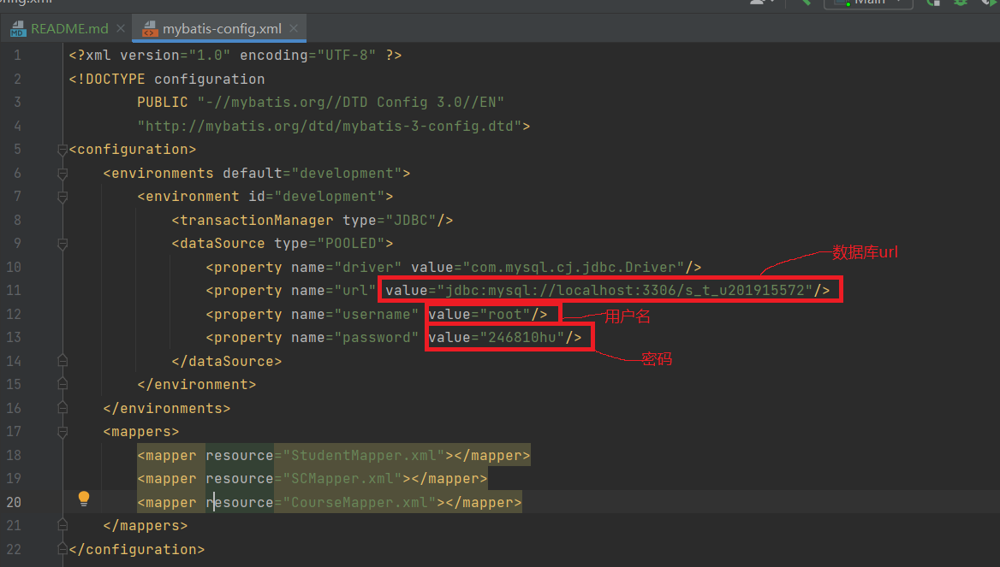
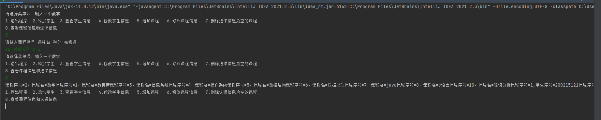

## HUST_CSE Database Lab(华中科技大学网络空间安全学院数据库系统设计实验)
1.**项目概述**  
编程语言为java，使用的ORM框架为mybatis，使用mybatis操作数据库很方便，基本上只要写sql语句，<a href="https://mybatis.org/mybatis-3/zh/index.html">mybatis官方文档地址</a>  

2.**使用方法**  
+ 创建数据库和表，注意表字段的定义类型和名称，可以参考[初始化表](./init.sql)
+ 在idea中打开项目，jdk版本要求>=11，然后在[mybatis配置文件](./src/main/resources/mybatis-config.xml)中更改数据库URL,用户名和密码
，然后运行项目即可
  
    

3.**运行效果**
